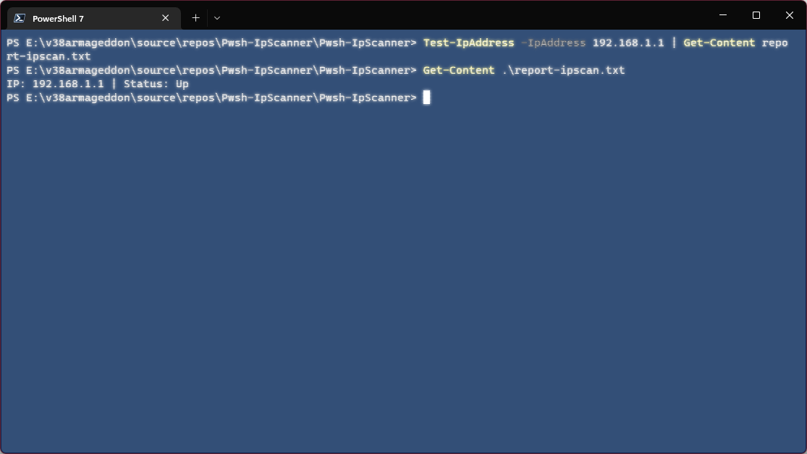

# Pwsh-IpScanner




⚠️ This project has reached its end of life and will be no longer maintained! Reason: Resources are now being redirected to higher-priority initiatives.

IP Scanner with port support for PowerShell, made in PowerShell.

## Installation


Simply run the following command: 
```powershell
PS> Install-Module -Name Pwsh-IpScanner
```

More information here: https://www.powershellgallery.com/packages/Pwsh-IpScanner

## Usage
``Test-IpAddress -IpAddress (-Port <Port>)`` : Scan a IP address.

``Test-IpRange -StartIp <IP> -EndIp <IP> (-StartPort <Port>) (-EndPort <Port>)`` : Scan a range of IP addresses.
